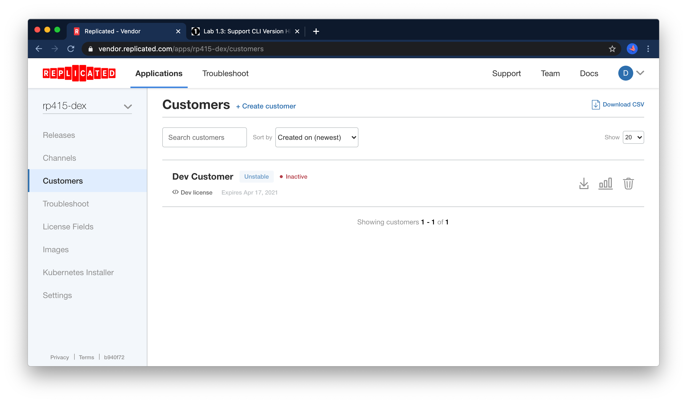
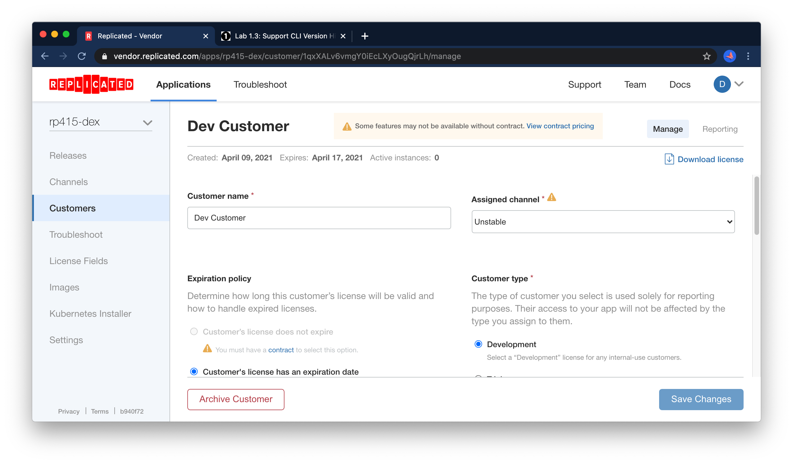

Lab 0: Hello World
=========================================

This exercise is designed to give you a sandbox to ensure you have the basic CLI tools set up and are prepared to proceed 
with the exercises in Lab 1. 

The README and the YAML sources draw from https://github.com/replicatedhq/replicated-starter-kots

### Get started

To start, you'll want to clone this repo somewhere. Optionally, you can fork it first (or you can do this later).

```shell script
git clone git@github.com:replicatedhq/kots-field-labs
cd kots-field-labs/lab1-kots/lab1-e0-hello-world
```

#### Install CLI

### 1. Install CLI

To start, you'll want to install the `replicated` CLI.
You can install with [homebrew](https://brew.sh) or grab the latest Linux or macOS version from [the replicatedhq/replicated releases page](https://github.com/replicatedhq/replicated/releases).

##### Brew

```shell script
brew install replicatedhq/replicated/cli
```

##### Manual

```shell script
curl -s https://api.github.com/repos/replicatedhq/replicated/releases/latest \
           | grep "browser_download_url.*$(uname | tr '[:upper:]' '[:lower:]')_amd64.tar.gz" \
           | cut -d : -f 2,3 \
           | tr -d \" \
           | cat <( echo -n "url") - \
           | curl -fsSL -K- \
           | tar xvz replicated
```
Then move `./replicated` to somewhere in your `PATH`:


```shell script
mv replicated /usr/local/bin/
```

##### Verifying

You can verify it's installed with `replicated version`:

```text
$ replicated version
```
```json
{
  "version": "0.31.0",
  "git": "c67210a",
  "buildTime": "2020-09-03T18:31:11Z",
  "go": {
      "version": "go1.14.7",
      "compiler": "gc",
      "os": "darwin",
      "arch": "amd64"
  }
}
```


#### 2. Configure environment

You should have received an invite to log into https://vendor.replicated.com -- you'll want to accept this invite and set your password.

You will be in a shared account with all other lab participants -- once you log in, you'll want to select your specific app for the lab:


Now, you'll need to set up two environment variables to interact with vendor.replicated.com:

```
export REPLICATED_APP=...
export REPLICATED_API_TOKEN=...
```

`REPLICATED_APP` should be set to the app slug from the Settings page. You should have received your App Name
ahead of time.

<p align="center"></img></p>

Next, create a `read/write` API token from the [Teams and Tokens](https://vendor.replicated.com/team/tokens) page:
> Note: Ensure the token has "Write" access or you'll be unable create new releases.

<p align="center"></img></p>

Once you have the values,
set them in your environment.

```
export REPLICATED_APP=...
export REPLICATED_API_TOKEN=...
```

You can ensure this is working with

```
replicated release ls
```

#### 3. Verifying manifests

You should have a few YAML files in `manifests`:


```text
$ ls -la manifests
.rw-r--r--  114 dex 16 Aug  7:59 config-map.yaml
.rw-r--r--  906 dex 16 Aug  7:59 config.yaml
.rw-r--r--  608 dex 16 Aug  7:59 deployment.yaml
.rw-r--r--  296 dex 16 Aug  7:59 ingress.yaml
.rw-r--r-- 2.5k dex 16 Aug  7:59 preflight.yaml
.rw-r--r--  399 dex 16 Aug  7:59 replicated-app.yaml
.rw-r--r--  205 dex 16 Aug  7:59 service.yaml
.rw-r--r--  355 dex 16 Aug  7:59 support-bundle.yaml
```

You can verify this yaml with `replicated release lint`:

```shell script
replicated release lint --yaml-dir=manifests
```

You should get a list that returns no errors, and exits with a 0 exit code. Output should look something like this:

```text
RULE                   TYPE    FILENAME                     LINE    MESSAGE
config-spec            warn                                                                        Missing config spec
container-resources    info    manifests/deployment.yaml    17      Missing container resources
```

* * *

### 4. Creating our first release


Now that we have some YAML, let's create a release and promote it to the `Unstable` channel so we can test it internally.
You can inspect the `Makefile` to get a sense of what is happening under the hood, but for now, for simplicity we'll use the Makefile command,
for this and all future labs in this program.


```shell script
make release
```

You can verify the release was created with `release ls`:

```text
$ replicated release ls
SEQUENCE    CREATED                      EDITED                  ACTIVE_CHANNELS
1           2020-09-03T11:48:45-07:00    0001-01-01T00:00:00Z    Unstable
```

* * *

### 5. Download a Customer License

A customer license (downloadable as a `.yaml` file) is required to install any KOTS application.
To create a customer license, log in to the [Vendor Portal](https://vendor.replicated.com) and select the "Customers" link on the left. A customer has already been created for you



You can view the customer details by clicking the row. You'll notice that the customer is assigned to the the "Unstable" channel on the right hand side, and the Customer Type is set to "Development".
When you've reviewed these, you can click the "Download License" link in the top right corner.



This will download the file with your customer name and a `.yaml` extension.
This is the license file a customer would need to install your application.


Alternatively, you can also use the CLI to review customers and download license files:

```text
replicated customer ls
```


```shell script
replicated customer download-license --customer "Dev Customer" > dev-customer.yaml
```
Whether you used the UI or CLI, you can verify the license file you downloaded with `cat` or at the very least `head`:

```text
$ head dev-customer.yaml

apiVersion: kots.io/v1beta1
kind: License
metadata:
  name: some-big-bank
spec:
  appSlug: kots-dex
  channelName: Unstable
  customerName: Some-Big-Bank
  endpoint: https://replicated.app
```
 * * *

### 6. Getting an install command

Next, let's get the install commands for the Unstable channel with `channel inspect`:

```shell script
replicated channel inspect Unstable
```

Output should look something like this:

```
ID:             VEr0nhJBBUdaWpPaOIK-SOryKZEwa3Mg
NAME:           Unstable
DESCRIPTION:
RELEASE:        1
VERSION:        Unstable-ba710e5
EXISTING:

    curl -fsSL https://kots.io/install | bash
    kubectl kots install cli-quickstart-puma/unstable

EMBEDDED:

    curl -fsSL https://k8s.kurl.sh/cli-quickstart-puma-unstable | sudo bash

AIRGAP:

    curl -fSL -o cli-quickstart-puma-unstable.tar.gz https://k8s.kurl.sh/bundle/cli-quickstart-puma-unstable.tar.gz
    # ... scp or sneakernet cli-quickstart-puma-unstable.tar.gz to airgapped machine, then
    tar xvf cli-quickstart-puma-unstable.tar.gz
    sudo bash ./install.sh airgap
```

* * *

### 7. Installing KOTS

A server has already been provisioned for this exercise, you'll want to find the one with the name matching `lab1-e0-hello-world`. 
KOTS has not yet been installed on this server, to give you an opportunity to experiment with the install process.

###### On the Server

Next, ssh into the server we just created, and run the install script from above, using the `EMBEDDED` version:

```shell
curl -sSL https://k8s.kurl.sh/<app-slug-name>-<channel name> | sudo bash
```

This script will install Docker, Kubernetes, and the KOTS admin console containers (kotsadm).

Installation should take about 5-10 minutes.

You should expect output like this:

```text

Kotsadm: http://[ip-address]:8800
Login with password (will not be shown again): [password]


To access the cluster with kubectl, reload your shell:

    bash -l

The UIs of Prometheus, Grafana and Alertmanager have been exposed on NodePorts 30900, 30902 and 30903 respectively.

To access Grafana use the generated user:password of admin:[password] .

To add worker nodes to this installation, run the following script on your other nodes
    curl -sSL https://kurl.sh/cli-quickstart-puma-unstable/join.sh | sudo bash -s kubernetes-master-address=[ip-address]:6443 kubeadm-token=[token] kubeadm-token-ca-hash=sha256:[sha] kubernetes-version=1.16.4 docker-registry-ip=[ip-address]

```

Please note the Kotsadm URL and Password in the above output. We will use this later to complete the install of the application.

Per the instructions, run the following to reload your shell so that you can run `kubectl`

```shell script
bash -l
```

Test `kubectl` with the following command:
```shell script
kubectl get pods
```

Expect output like this:

```bash
NAME                                  READY   STATUS      RESTARTS   AGE
kotsadm-585579b884-v4s8m              1/1     Running     0          4m47s
kotsadm-migrations                    0/1     Completed   2          4m47s
kotsadm-operator-fd9d5d5d7-8rrqg      1/1     Running     0          4m47s
kotsadm-postgres-0                    1/1     Running     0          4m47s
kurl-proxy-kotsadm-77c59cddc5-qs5bm   1/1     Running     0          4m46s
user@kots-guide:~$
```

* * *

### 8. Install the Application

At this point, Kubernetes and the Admin Console are running, but the application isn't deployed yet.
To complete the installation, visit the URL noted previously in your browser.  The URL is shown in the output from the installation script.

Click "Continute and Setup" in the browser to continue to the secure Admin Console.

<!-- TODO: insert picture of insecure landing page. -->

Accept the insecure certificate.


<!-- TODO: Insert screenshot of certificate warning -->

Click the "skip this step" button in the admin console.
> Note, For production installations we recommend uploading a trusted cert and key, but for this tutorial we will proceed with the self-signed cert.


Paste in the password noted previously on the password screen. The password is shown in the output from the installation script.


Until this point, this server is just running Docker, Kubernetes, and the kotsadm containers.
The next step is to upload a license file so KOTS can pull containers and run your application. Use the license file we downloaded in step 5.
Click the Upload button and select your `.yaml` file to continue, or drag and drop the license file from a file browser. 


Preflight checks are designed to ensure this server has the minimum system and software requirements to run the application.
Depending on your YAML in `preflight.yaml`, you may see some of the example preflight checks fail.
If you have failing checks, you can click continue -- the UI will show a warning that will need to be dismissed before you can continue.


You will be presented with the application dashboard where you can see various information and metrics.


Run the following in the console to show the nginx application we just deployed:
```shell script
kubectl get pods
```

### View the application

Use the "Open Lab 0" button in the dashboard to open the NGINX server. 

Since this example uses the default nginx application, you should see a basic (perhaps familiar) nginx server running:


Next, we'll walk through creating and delivering an update to the application we just installed.

* * *

### 9. Iterating

From our local repo, we can update the nginx deployment to test a simple update to the application.
We'll add a line to `nginx-deployment.yaml`, right after `spec:`. The line to add is

```yaml
  replicas: 2
```

Using `head` to view the first 10 lines of the file should give the output below

```shell script
head manifests/nginx-deployment.yaml
```

```yaml
apiVersion: apps/v1
kind: Deployment
metadata:
  name: nginx
  labels:
    app: nginx
spec:
  replicas: 2
  selector:
    matchLabels:
```

Once you've added the `replicas` line, you can create a new release:

```shell script
make release
```

### Update the Test Server

To install and test this new release, we need to connect to the Admin Console dashboard on port :8800 using a web browser.
At this point, it will likely show that our test application is "Up To Date" and that "No Updates" Are Available.
The Admin Console can be configured to check for new updates at regular intervals but for now we'll trigger a check manually by clicking "Check for Updates".
You should see a new release in the history now.
You can click the +/- diff numbers to review the diff, but for now let's click "Deploy" to roll out this new version.


Clicking the Deploy button will apply the new YAML which will change the number of nginx replicas, this should only take a few seconds.
You can verify this on the server by running

```shell script
kubectl get pod -l app=nginx
```

You should see two pods running.

* * *

### Next Steps

From here, you can continue iterating on your application to explore KOTS features.
Continue making changes and using `make release` to publish them.
