Lab 1.5: Airgap
=========================================

In this lab, we'll review how to perform installations in airgapped environments, and
how to collect support bundles in airgapped environments.

In this case we'll start with a bare airgapped server with no KOTS installation, so you can
get practice performing an airgap install from scratch.

Once that's done, we'll explore how some of the support techniques differ between online and airgapped environments. 

***
## Airgap Workflow Overview

First, we'll push a release -- in the background, Replicated's airgap builder will prepare an airgap bundle.

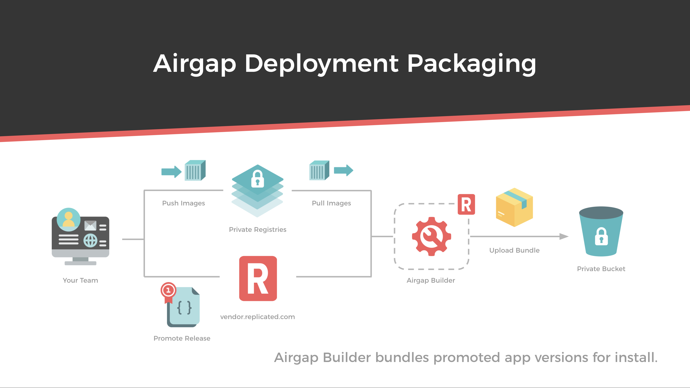

Next, we'll collect a license file, a download link, and a public kURL bundle.


From there, we'll move all three artifacts into the datacenter via a jump box.


The above diagram shows a three node cluster, but we'll use only a single node.
While the KOTS bundle will be moved onto the server via SCP as in the diagram,
the app bundle and license file will be uploaded via a browser UI through an SSH tunnel.

***
## Getting Started

You should have received an invite to log into https://vendor.replicated.com -- you'll want to accept this invite and set your password.

Now, you'll need to set up two environment variables to interact with vendor.replicated.com:


`REPLICATED_APP` should be set to the app slug from the Settings page. You should have received your App Name
ahead of time.


`REPLICATED_API_TOKEN` should have been provided ahead of time or during the working session.

Once you have the values,
set them in your environment.

```
export REPLICATED_APP=...
export REPLICATED_API_TOKEN=...
```

Lastly before continuing make sure to clone this repo locally as we will be modifying `lab05` later during the workshop.
```bash
git clone https://github.com/replicatedhq/kots-field-labs
cd kots-field-labs/labs/lab05-airgap
```

***
## Instance Overview

You will have received the IP of a jump box and the name of an airgapped server.
For example, you may have received:

```text
dx411-dex-lab05-airgap-jump = 104.155.131.205
dx411-dex-lab05-airgap
```

In general, the name of the private server will be the same as the jump box, with the characters `-jump` removed from the suffix.
Put another way, you could construct both instance names programatically as

```shell
${REPLICATED_APP}-lab05-airgap-jump
```

and

```shell
${REPLICATED_APP}-lab05-airgap
```

### Connecting

First set your application slug, and the public IP of your jump box:

```shell
export JUMP_BOX_IP=...
export REPLICATED_APP=... # your app slug
```

Next, you can SSH into the airgapped server using the following command:

```shell
ssh -J kots@${JUMP_BOX_IP} kots@${REPLICATED_APP}-lab05-airgap
```
> **NOTE**: You will be prompted **twice** to change the password on first login. Once for the JUMP_BOX and again for the AIRGAP server.

Once you're on the airgap server, you can verify that the server indeed does not have internet access. Once you're convinced, you 
can ctrl+C the command and proceed to the next section

```shell
curl -v https://kubernetes.io
```
***
## Moving Assets into place

If you haven't already, you can log out of the airgapped instance with `exit` or ctrl+D. 
Our next step is to collect the assets we need for an airgapped installation:

1. A license with the airgap entitlement enabled
2. An airgap bundle containing the kURL cluster components
3. An airgap bundle containing the application components

(2) and (3) are separate artifacts to cut down on bundle size during upgrade scenarios where only the application version 
is changing and no changes are needed to the underlying cluster.

#### Building an Airgap Release

By default, only the Stable and Beta channels will automatically build airgap bundles

- manually build
- set channel to auto build

For a production application, airgap releases will be built automatically on the Stable channel, so this won't
be necessary.

In this case, since we're working off the `lab05-airgap` channel, you'll want to enable airgap builds on that channel.

You can check the build status by navigating to the "Release History" for the channel.

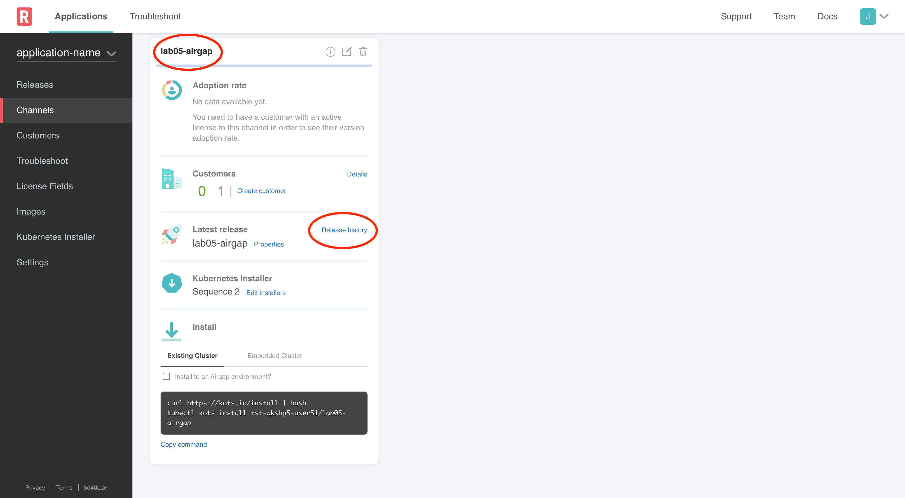

You can build invividual bundles on the Release History page, but you'll likely want to edit the channel and enable "build all releases for this channel".

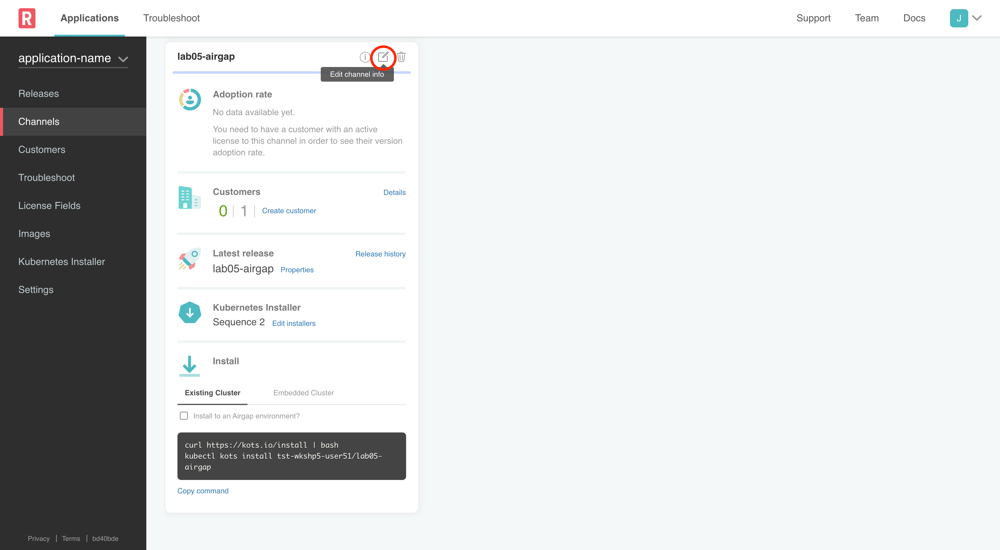

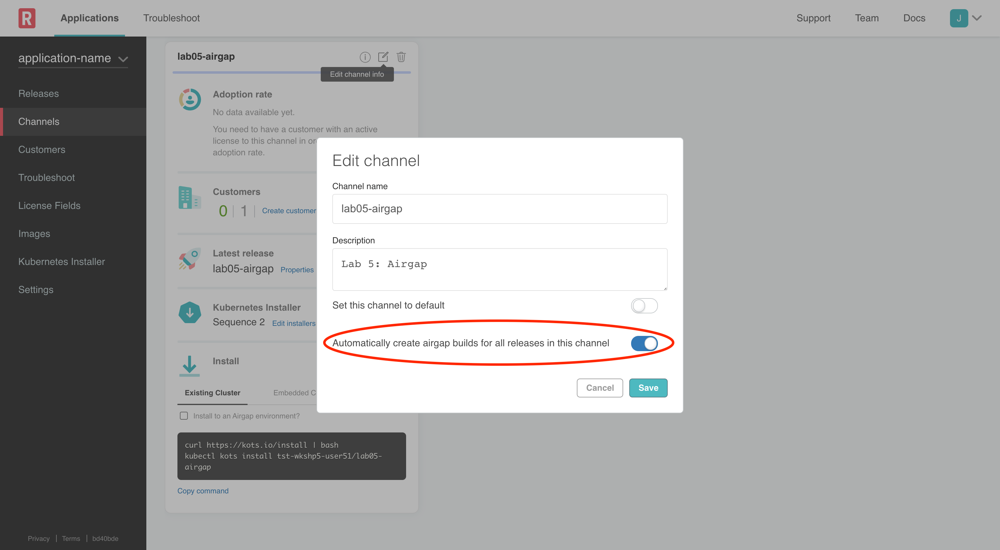

Now you should see all the bundles building or built on the release history page:


#### Enabling Airgap for a customer

The first step will be to enable airgap for the `lab5` customer:


#### Download Airgap Assets 
After saving the customer, scroll to the bottom of the page to the `Download Portal` section.

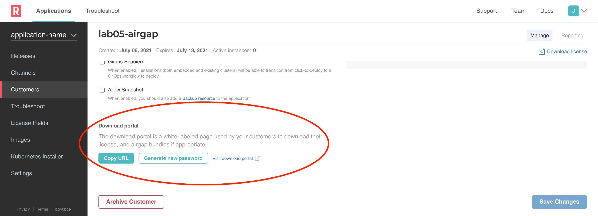

Generate a new password and save it somewhere in your notes.
Next, click the link to open the download portal. 
This is a link you would usually send to your customer, so from here on we'll be wearing our "end user" hat.


Navigate to the "embedded cluster" option and review the three downloadable assets.

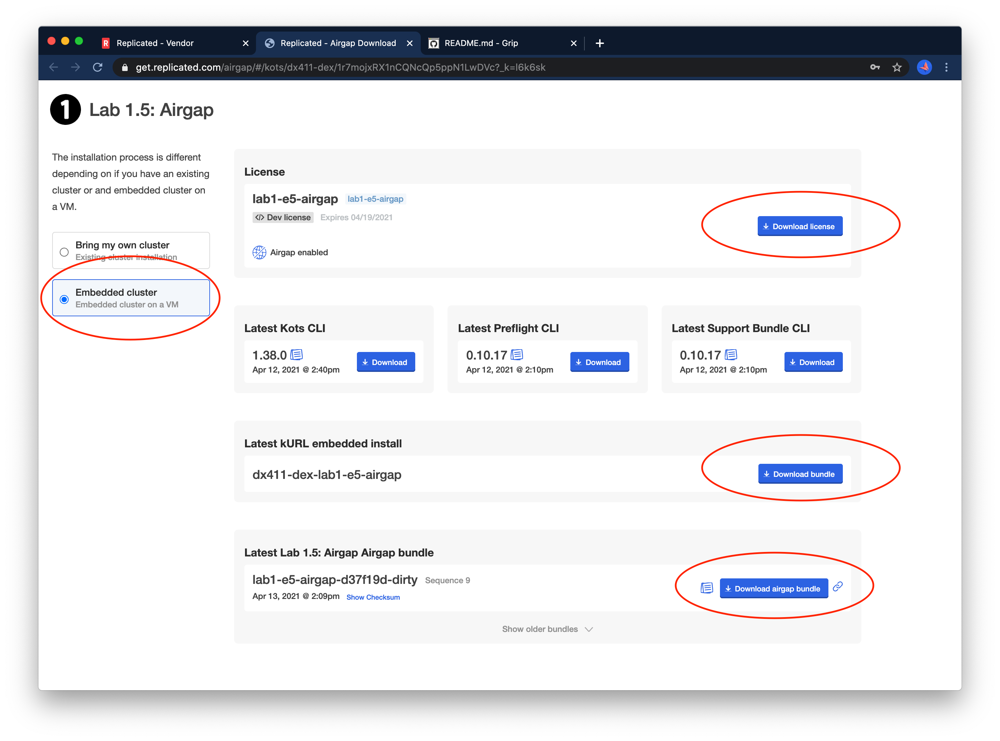

Download the license file, but **don't download the kURL bundle**.
While you can download the kURL bundle directly to your workstation and copy it to the remote server, you'll
likely be able to go much faster if you copy the URL and download the assets directly onto the jump box.
You can copy each URL as shown below:

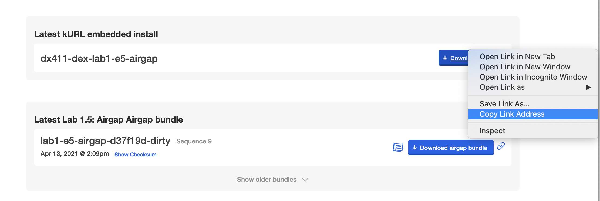

You'll want to download the other bundle `Latest Lab 1.5: Airgap Bundle` to your workstation.

Now, let's SSH to our jump box (the one with the public IP) `ssh -A kots@<jump box IP address>` and download the kurl bundle.
We'll use the `-A` flag to the `ssh` command to forward our agent so we can interact with the airgapped node as well.
Replace the URL with the one you copied above.

```text
kots@dx411-dex-lab05-airgap-jump ~$ curl -o kurlbundle.tar.gz https://kurl.sh/bundle/dx411-dex-lab05-airgap.tar.gz
```

When it's finished, copy it to the airgapped server. 
You can use the DNS name in this case, as described in [Instance Overview](#instance-overview).
In this example we've SSH'd the jump box with the -A flag so the SSH agent will be forwarded.

```text
kots@dx411-dex-lab05-airgap-jump ~$ scp kurlbundle.tar.gz kots@dx411-dex-lab05-airgap:/home/kots

```

> **Note**: -- we use SCP via an SSH tunnel in this case, but the airgap methods in this lab also extend to
more locked down environments where e.g. physical media is required to move assets into the datacenter.

Now we'll SSH all the way to airgap node. If you still have a shell on your jump box, you can use the instance name.

```text
kots@dx411-dex-lab05-airgap-jump ~$ ssh dx411-dex-lab05-airgap
```

Otherwise, you can use the above 

```shell
ssh -J kots@lab05-airgap-jump kots@${REPLICATED_APP}-lab05-airgap
```

Once you're on the "airgapped" node, untar the bundle and run the install script with the `airgap` flag.
kURL install flags are documented [in the kurl.sh docs](https://kurl.sh/docs/install-with-kurl/advanced-options).

```shell
tar xvf kurlbundle.tar.gz
sudo bash install.sh airgap
```

At the end, you should see a `Installation Complete` message as shown below. Since the instance is airgapped, we'll need to create a port forward to access the UI from your workstation in the next step.


***
## Accessing the UI via SSH tunnel, Configuring the instance

You'll want to create a port forward from your workstation in order to access to UI locally.
Again we'll use `REPLICATED_APP` to construct the DNS name but you can input it manually as well.

```shell
export JUMP_BOX_IP=... # your jumpbox IP
export REPLICATED_APP=... # your app slug
ssh -NL 8800:${REPLICATED_APP}-lab05-airgap:8800 -L 8888:${REPLICATED_APP}-lab05-airgap:8888 kots@${JUMP_BOX_IP}
```

This will run in the foreground, and you wont see any output. At this point, Kubernetes and the Admin Console are running inside the air gapped server, but the application isn't deployed yet.
To complete the installation, visit http://localhost:8800 in your browser.

Click "**Continue and Setup**" in the browser to continue to the secure Admin Console.

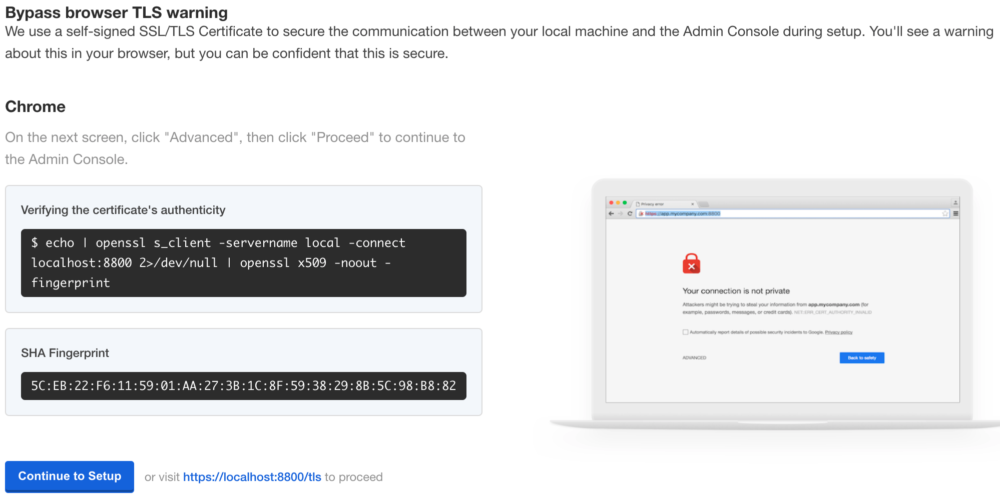

Click the "**Skip and continue**" to Accept the insecure certificate in the admin console.
> **Note**: For production installations we recommend uploading a trusted cert and key, but for this tutorial we will proceed with the self-signed cert.

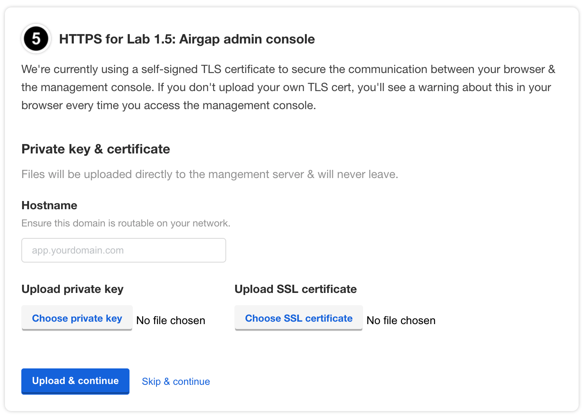

At the login screen paste in the password noted previously on the `Installation Complete` screen. The password is shown in the output from the installation script.

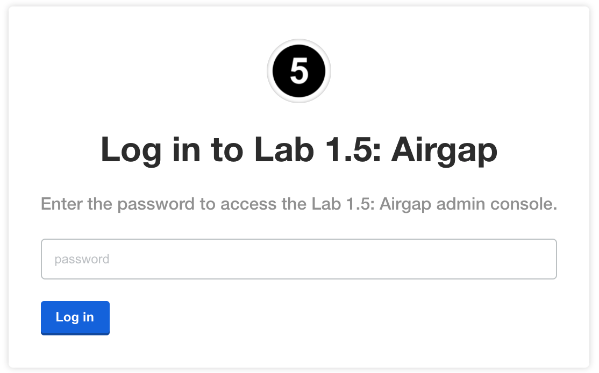

Until this point, this server is just running Docker, Kubernetes, and the kotsadm containers.
The next step is to upload a license file so KOTS can validate which application is authorized to be deployed. Use the license file we downloaded earlier.

Click the Upload button and select your `.yaml` file to continue, or drag and drop the license file from a file browser. 

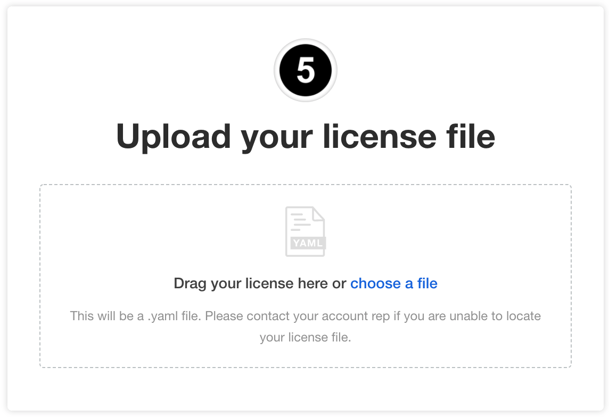

After you upload your license, you'll be greeted with an Airgap Upload screen. Select **choose a bundle to upload** and use the "application bundle" that you
downloaded to your workstation using the customer portal here. Click **Upload airgap bundle** to continue the upload process.

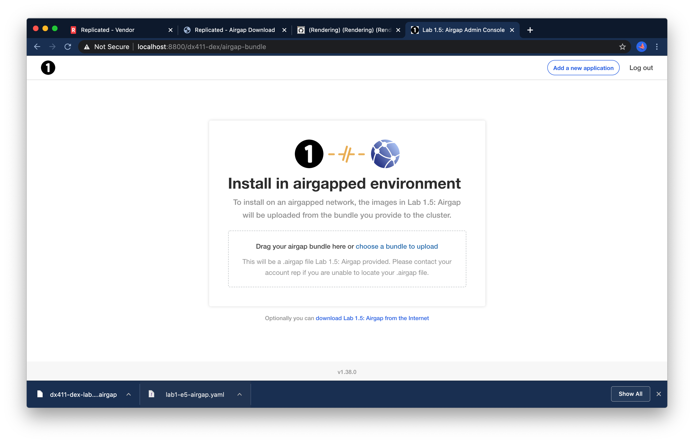

You'll see the bundle uploaded and images being pushed to kURL's internal registry. This will take a few minutes to complete.

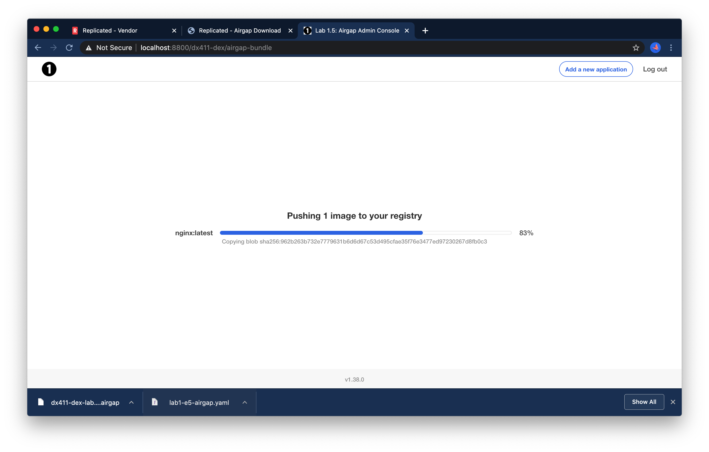

Once uploaded `Preflight Checks` will run. These are designed to ensure this server has the minimum system and software requirements to run the application.
Depending on your YAML in `preflight.yaml`, you may see some of the example preflight checks fail.
If you have failing checks, you can click continue -- the UI will show a warning that will need to be dismissed before you can continue.


We'll find that the application is unavailable. 

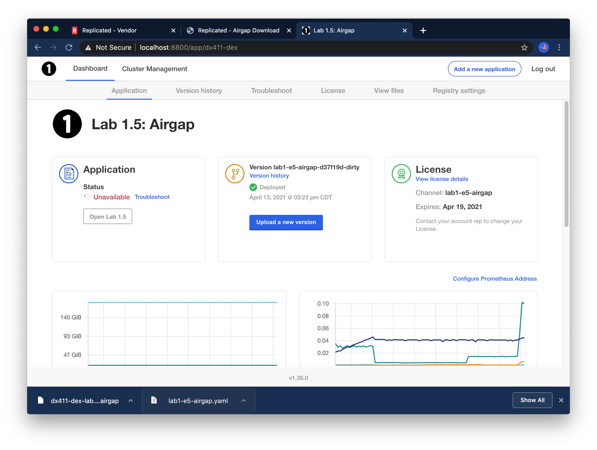

While we'll explore [support techniques for airgapped environments](#collecting-a-cli-support-bundle) 
below, in this case you should observe that our deployment is simply not valid, specifically, the
standard nginx entrypoint has been overriden:

```yaml
      containers:
        - name: nginx
          image: nginx
          command:
            - exit
            - "1"
```

So we'll need to create a new release in order to fix this.

***
## Deploying a new version

From the `labs/lab05-airgap` directory, update the `manifests/nginx-deployment.yaml` file to remove the command override as shown below.


```diff
diff --git a/labs/lab05-airgap/manifests/nginx-deployment.yaml b/labs/lab05-airgap/manifests/nginx-deployment.yaml
index fa29e8d..3a66405 100644
--- a/labs/lab05-airgap/manifests/nginx-deployment.yaml
+++ b/labs/lab05-airgap/manifests/nginx-deployment.yaml
@@ -16,9 +16,6 @@ spec:
       containers:
         - name: nginx
           image: nginx:latest
-          command:
-            - exit
-            - "1"
           volumeMounts:
             - mountPath: /usr/share/nginx/html
               name: html
```

Once you're satisfied with your `nginx-deployment.yaml` create a new release with `make release`.
You'll need to ensure you have your `REPLICATED_APP` and `REPLICATED_API_TOKEN` set. See the **Getting Started** section for information on how to obtain and set these.

```shell
make release
```

Once the release is made, you should be able to navigate back to the customer download portal we accessed from the customer page.
Scrolling to the bottom, you can click "show older bundles" to see the history of releases on the lab05-airgap channel.
The new release may take a minute or two to build, so you're want to refresh the make until you see one
with a timestamp that matches when you ran `make release`.

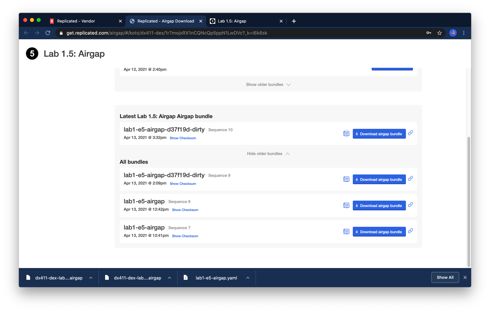

Once you've downloaded the new version, in the KOTS Admin Console select **Version History** and click "**Upload a new version**" and select your bundle.

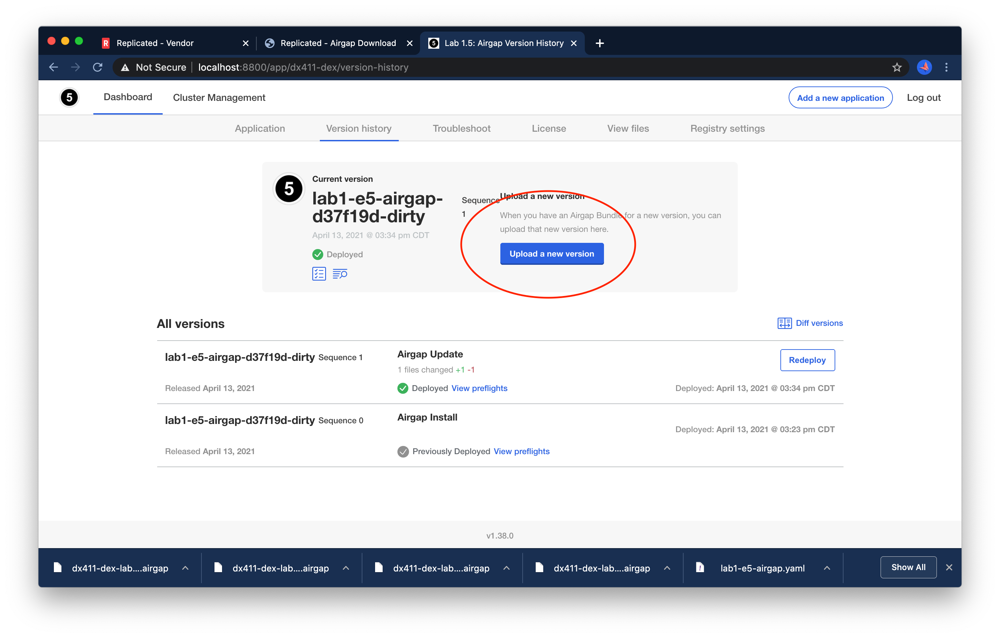

You'll see the bundle upload as before and you'll have the option to deploy it once the
preflight checks complete. Click **Deploy** to perform the upgrade.

Click the **Application** button to navigate back to the main landing page. The app should now show as **Ready** status on the main dashboard.

In order to access the application select **Open Lab 5**. 
> **Note**: For this work successfully you'll need to ensure the SSH tunnel for the app's port (8888) was initialized.

Congrats! You've installed and then upgraded an airgapped instance!

***
## Collecting a CLI support bundle

As a final step, we'll review how to collect support bundles. However, what would we do in the case that the app installation itself was failing?
We can try our `kots.io` support bundle from the airgapped server.

```shell
kubectl support-bundle https://kots.io
```

As you might expect this will fail because we can't fetch the spec from the internet.

```text
Error: failed to load collector spec: failed to get spec from URL: execute request: Get "https://kots.io": dial tcp 104.21.18.220:443: i/o timeout
```

In this case, we'll want to pull in the spec from https://github.com/replicatedhq/kots/blob/master/support-bundle.yaml.
How you get this file onto the server is up to you -- expand below for an option that uses `cat` with a heredoc.


<details> 

```shell
cat <<EOF > support-bundle.yaml
apiVersion: troubleshoot.sh/v1beta2
kind: SupportBundle
metadata:
  name: collector-sample
spec:
  collectors:
    - clusterInfo: {}
    - clusterResources: {}
    - ceph: {}
    - exec:
        args:
          - "-U"
          - kotsadm
        collectorName: kotsadm-postgres-db
        command:
          - pg_dump
        containerName: kotsadm-postgres
        name: kots/admin_console
        selector:
          - app=kotsadm-postgres
        timeout: 10s
    - exec:
        args:
          - "http://localhost:3030/goroutines"
        collectorName: kotsadm-goroutines
        command:
          - curl
        containerName: kotsadm
        name: kots/admin_console
        selector:
          - app=kotsadm
        timeout: 10s
    - exec:
        args:
          - "http://localhost:3030/goroutines"
        collectorName: kotsadm-operator-goroutines
        command:
          - curl
        containerName: kotsadm-operator
        name: kots/admin_console
        selector:
          - app=kotsadm-operator
        timeout: 10s
    - logs:
        collectorName: kotsadm-postgres-db
        name: kots/admin_console
        selector:
          - app=kotsadm-postgres
    - logs:
        collectorName: kotsadm-api
        name: kots/admin_console
        selector:
          - app=kotsadm-api
    - logs:
        collectorName: kotsadm-operator
        name: kots/admin_console
        selector:
          - app=kotsadm-operator
    - logs:
        collectorName: kotsadm
        name: kots/admin_console
        selector:
          - app=kotsadm
    - logs:
        collectorName: kurl-proxy-kotsadm
        name: kots/admin_console
        selector:
          - app=kurl-proxy-kotsadm
    - logs:
        collectorName: kotsadm-dex
        name: kots/admin_console
        selector:
          - app=kotsadm-dex
    - logs:
        collectorName: kotsadm-fs-minio
        name: kots/admin_console
        selector:
          - app=kotsadm-fs-minio
    - logs:
        collectorName: kotsadm-s3-ops
        name: kots/admin_console
        selector:
          - app=kotsadm-s3-ops
    - secret:
        collectorName: kotsadm-replicated-registry
        includeValue: false
        key: .dockerconfigjson
        name: kotsadm-replicated-registry
    - logs:
        collectorName: rook-ceph-agent
        selector:
          - app=rook-ceph-agent
        namespace: rook-ceph
        name: kots/rook
    - logs:
        collectorName: rook-ceph-mgr
        selector:
          - app=rook-ceph-mgr
        namespace: rook-ceph
        name: kots/rook
    - logs:
        collectorName: rook-ceph-mon
        selector:
          - app=rook-ceph-mon
        namespace: rook-ceph
        name: kots/rook
    - logs:
        collectorName: rook-ceph-operator
        selector:
          - app=rook-ceph-operator
        namespace: rook-ceph
        name: kots/rook
    - logs:
        collectorName: rook-ceph-osd
        selector:
          - app=rook-ceph-osd
        namespace: rook-ceph
        name: kots/rook
    - logs:
        collectorName: rook-ceph-osd-prepare
        selector:
          - app=rook-ceph-osd-prepare
        namespace: rook-ceph
        name: kots/rook
    - logs:
        collectorName: rook-ceph-rgw
        selector:
          - app=rook-ceph-rgw
        namespace: rook-ceph
        name: kots/rook
    - logs:
        collectorName: rook-discover
        selector:
          - app=rook-discover
        namespace: rook-ceph
        name: kots/rook
    - exec:
        collectorName: weave-status
        command:
        - /home/weave/weave
        args:
        - --local
        - status
        containerName: weave
        exclude: ""
        name: kots/kurl/weave
        namespace: kube-system
        selector:
        - name=weave-net
        timeout: 10s
    - exec:
        collectorName: weave-report
        command:
        - /home/weave/weave
        args:
        - --local
        - report
        containerName: weave
        exclude: ""
        name: kots/kurl/weave
        namespace: kube-system
        selector:
        - name=weave-net
        timeout: 10s

  analyzers:
    - textAnalyze:
        checkName: Weave Status
        exclude: ""
        fileName: kots/kurl/weave/kube-system/weave-net-*/weave-status-stdout.txt
        outcomes:
        - fail:
            message: Weave is not ready
        - pass:
            message: Weave is ready
        regex: 'Status: ready'
    - textAnalyze:
        checkName: Weave Report
        exclude: ""
        fileName: kots/kurl/weave/kube-system/weave-net-*/weave-report-stdout.txt
        outcomes:
        - fail:
            message: Weave is not ready
        - pass:
            message: Weave is ready
        regex: '"Ready": true'
EOF
```
</details>

Once this is present, you can use the following to collect a bundle as usual.

```shell
kubectl support-bundle ./support-bundle.yaml
```

Congrats! You've completed Exercise 5! [Back To Exercise List](https://github.com/replicatedhq/kots-field-labs/tree/main/labs)


***
## Extra exercises

If you finish the lab early you can:

1. Experiment with copying the CLI-generated bundle off the server and uploading it to https://vendor.replicated.com
1. Experiment with expanding or building your own `support-bundle.yaml` and using it to collect other information about the host
