Lab 1.8: Air gap
=========================================

In this lab, we'll review how to perform installations and collect support bundles in Air Gap environments.

* **What you will do**:
    * Access and verify a single-node Air Gap setup via a bastion server
    * Learn how to install in an Air Gap environment using app manager
    * Create an SSH tunnel to configure an Air Gap instance
    * Perform an upgrade of an application in an Air Gap environment
    * Use the `kubectl support-bundle` CLI in an Air Gap environment
* **Who this is for**:
    * Anyone who builds or maintains app manager applications (Full Stack / Devops/ Product Engineers)
* **Prerequisites**:
    * Basic working knowledge of Kubernetes
* **Outcomes**:
    * You can deliver an app manager application into an Air Gap environment
    * You can build confidence in performing upgrades and troubleshooting in Air Gap environments

## Overview

To practice performing an Air Gap installation from scratch, you will start this lab with a bare Air Gap server with no app manager installation. Then we'll explore how some of the support techniques differ between online and Air Gap environments.

***
## Airgap workflow overview

First, we'll push a release and Replicated's Air Gap builder will prepare an Air Gap bundle.


Next, we'll collect a license file, a download link, and a public Kubernetes installer bundle.


From there, we'll move all three artifacts into the datacenter via a jump box.


The above diagram shows a three node cluster, but this lab will only use a single node cluster.
The app manager bundle will be moved onto the server via SCP, while
the app bundle and license file will be uploaded via a browser UI through an SSH tunnel.

***
## Getting started


You will receive an invite to log into https://vendor.replicated.com, accept this invite and set your password.

From the Settings page, copy the Application Slug. You'll need this slug in a later step to set the `REPLICATED_APP`.

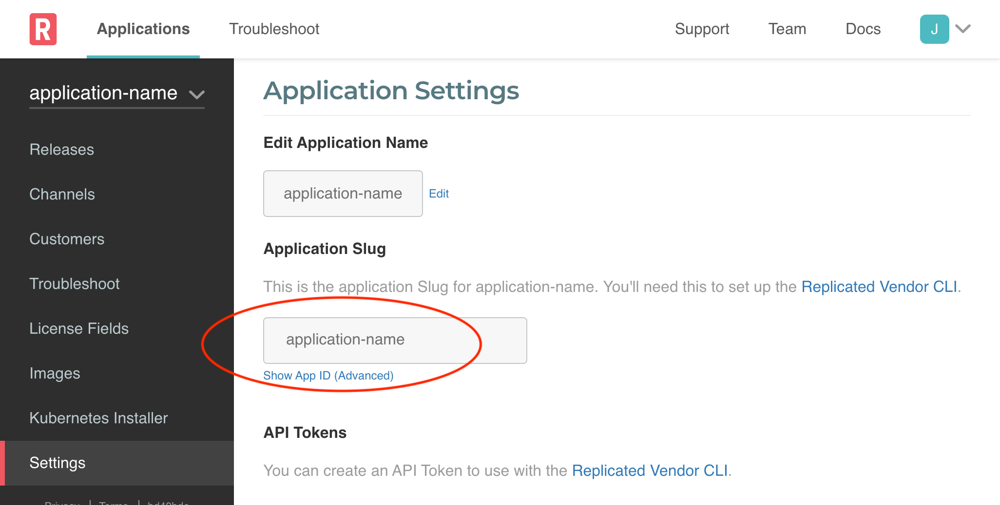

***
## Instance overview

You will receive the IP of a jump box and the name of an Air Gap server.

For example:

```text
dx411-dex-lab08-airgap-lite-jump = 104.155.131.205
dx411-dex-lab08-airgap-lite
```

In general, the name of the private server will be the same as the jump box, with the characters `-jump` removed from the suffix.

For example, you can construct both instance names programmatically as:

```shell
${REPLICATED_APP}-lab08-airgap-lite-jump
```


```shell
${REPLICATED_APP}-lab08-airgap-lite
```

### Connecting to the Air Gap server

1. Set your application slug, the public IP of your jump box and your first name:
    ```shell
    export JUMP_BOX_IP=...
    export REPLICATED_APP=... # your app slug
    export FIRST_NAME=... # your first name (lower case)
    ```
1. SSH into the Air Gap server using the following command:
    ```shell
    ssh -J ${FIRST_NAME}@${JUMP_BOX_IP} ${FIRST_NAME}@${REPLICATED_APP}-lab08-airgap-lite
    ```
    > **Note**: The `-J` option allows you to connect to the target host by first making a SSH connection to the jump host (`${JUMP_BOX_IP}`) described by the destination,  and then establishing a TCP forwarding to the ultimate destination (`${REPLICATED_APP}-lab08-airgap-lite`).

    Optional: Instead of using the above command to SSH into the Air Gap server, you can perform multiple steps to achieve the same result:
    ```shell
    local> ssh ${FIRST_NAME}@${JUMP_BOX_IP}
    jump> export REPLICATED_APP=...
    jump> ssh ${REPLICATED_APP}-lab08-airgap-lite
    ```

When you are on the Air Gap server, you can verify that the server does not have internet access. When you've confirmed no internet access exists, you can ctrl+C the below command and proceed to the next section.

```shell
curl -v https://kubernetes.io
```


***
## Moving Assets into place
To perform an Air Gap installation, you will need to collect the following assets:

* A license with the Air Gap entitlement enabled
* An Air Gap bundle containing the Kubernetes installer cluster components **
* An Air Gap bundle containing the application components **

> ** **Note**: These are separate artifacts to cut down on bundle size during upgrade scenarios where only the application version
is changing and no changes are needed to the underlying cluster.

If you haven't already, you can log out of the Air Gap instance with `exit` or ctrl+D.

#### Starting the Kubernetes installer bundle download

You will SSH into your jump box (the one with the public IP) `ssh kots@<jump box IP address>`, and download the Kubernetes installer bundle.

##### Enabling air gap for a customer

Enable Air Gap for the `lab8` customer and click **Save Changes**:

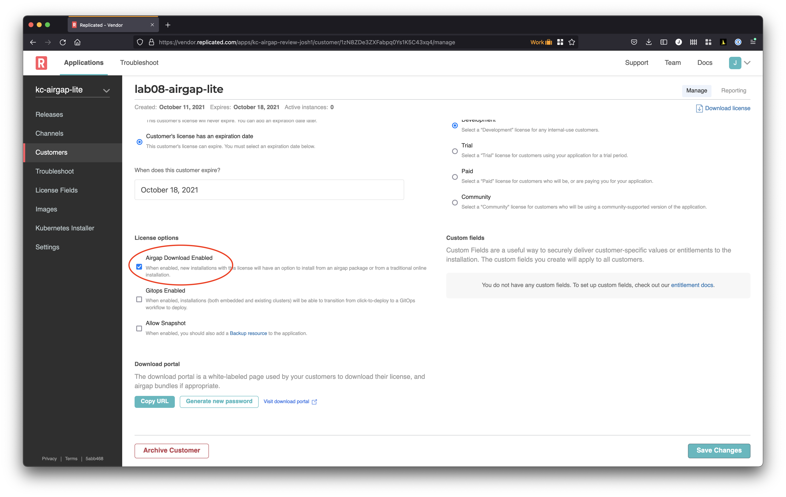


##### Downloading air gap assets
Scroll to the bottom of the page to the **Download Portal** section.


1. Click **Generate new password** and save the generated password somewhere in your notes.
1. Click the **View download portal** link to open the download portal.

    > **Note**: This is a link you would usually send to your customer, so from this point forward in the lab we will be wearing our "end user" hat.
1. Replace the URL below with the one you get from the download portal.

    ```text
    kots@dx411-dex-lab08-airgap-lite-jump ~$ curl -o kurlbundle.tar.gz <URL>
    ```


This will take several minutes to complete. You can leave this running and proceed to the next step, we'll come back in a few minutes.

#### Building an Airgap Release

By default, only the **Stable** and **Beta** channels will automatically build Air Gap bundles. For other channels, you have two options to create an Air Gap release:

- Manually build from the **Release history** view for a channel
- Set a channel to auto build all promoted releases

> **Note**: For a production application, Air Gap releases will be built automatically on the **Stable** channel.

For this lab, since we're working off the `lab08-airgap-lite` channel, you'll want to enable Air Gap builds on that channel.

You can check the build status by navigating to the **Release history** for the channel.

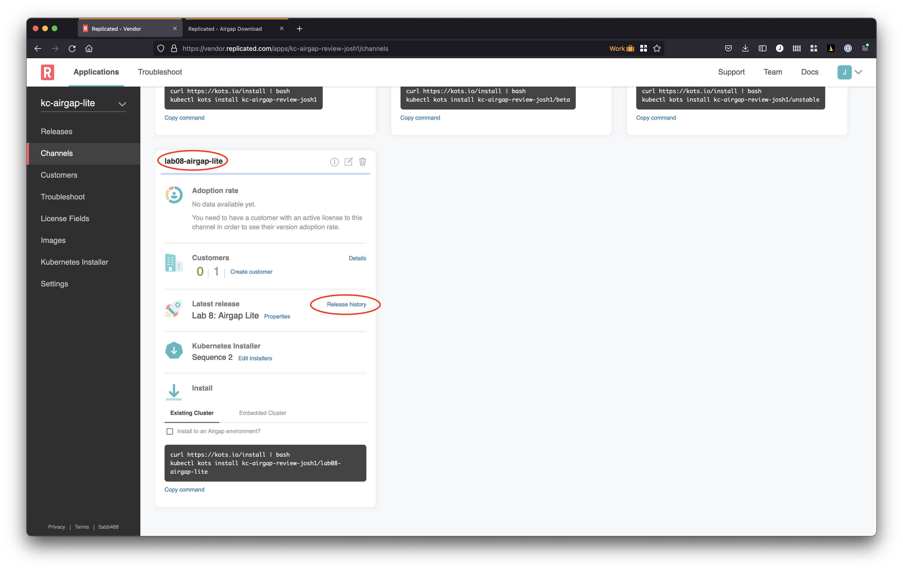

You can build individual bundles on the **Release history** page, but you'll likely want to edit the channel and enable the option for all releases. Next to **Automatically create airgap builds for all releases in this channel**, slide the toggle swith to `on` to enable this option.

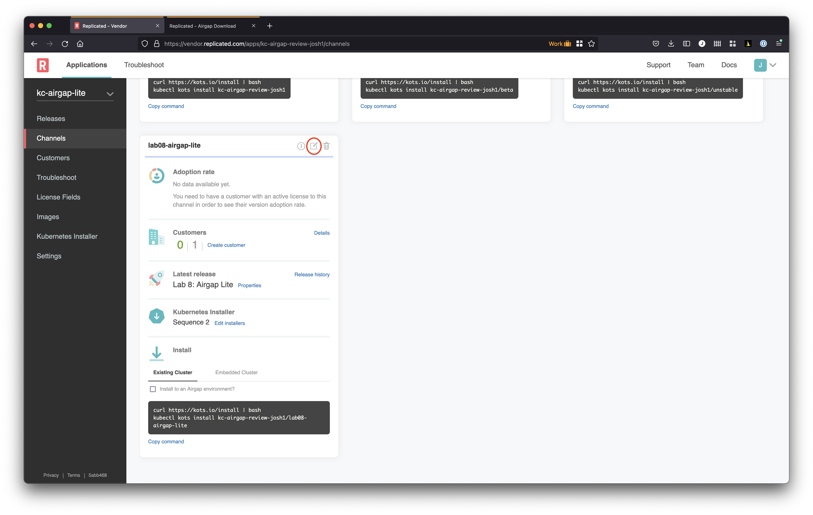

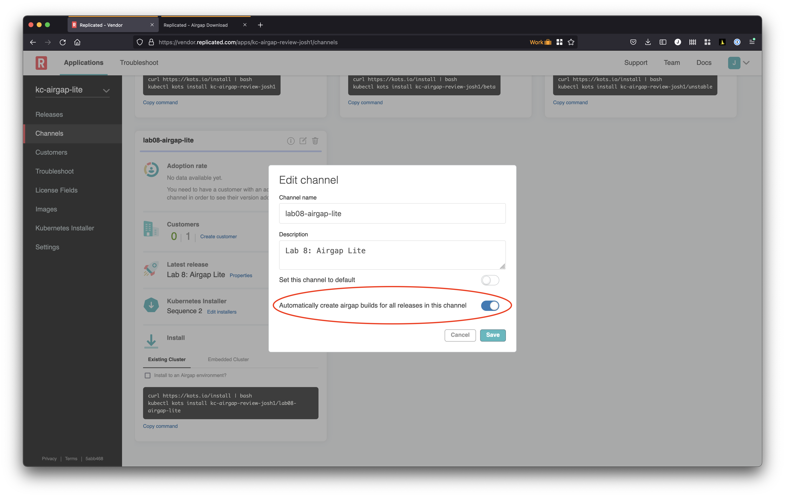

You should see all the bundles building or built on the **Release history** page:

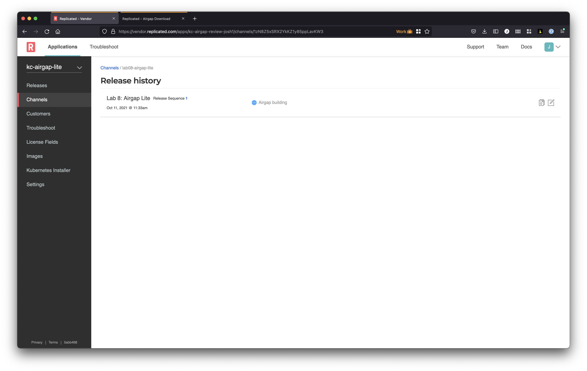

#### Continue downloading air gap assets
To continue downloading the air gap assets, navigate back to the download portal where we previously got the Kubernetes installer bundle URL.


1. Navigate to the **Embedded cluster** option and review the three downloadable assets.

   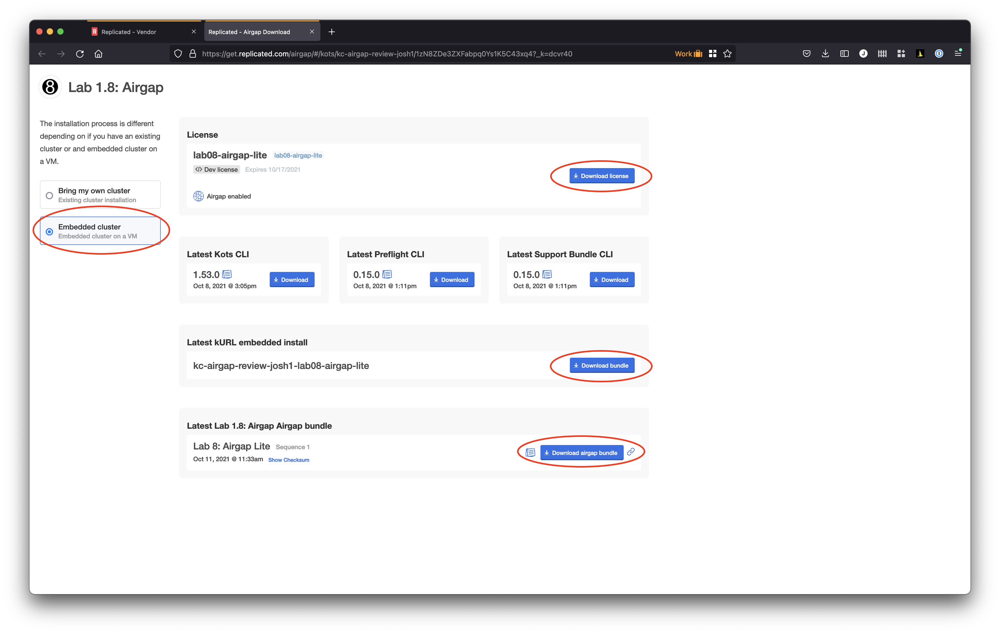

1. Download the license file, but **do not** download the Kubernetes installer (kURL) bundle. This download was already started on the server in a previous step above.

1. Download the `Latest Lab 1.8: Airgap Bundle` to your workstation.

1. SSH to your jump box (the one with the public IP) `ssh kots@<jump box IP address>` and check the download of the Kubernetes installer (kURL) bundle.

1. Replace the URL with the one you copied above.

At the beginning of the lab, we downloaded the bundle with this command from the Jump box:

```text
kots@dx411-dex-lab08-airgap-lite-jump ~$ curl -o kurlbundle.tar.gz <URL>
```

It should be finished now, so you can copy it to the Air Gap server.
You can use the DNS name in this lab, as described in the [Instance Overview](#instance-overview).

```text
kots@dx411-dex-lab08-airgap-lite-jump ~$ scp kurlbundle.tar.gz ${REPLICATED_APP}-lab08-airgap-lite:~

```

> **Note**: -- we use SCP via an SSH tunnel in this lab, but the Air Gap methods in this lab also extend to more locked down environments where, for example, physical media is required to move assets into the datacenter.

The next step is to SSH all the way to Air Gap node. If you still have a shell on your jump box, you can use the instance name:

```text
kots@dx411-dex-lab08-airgap-lite-jump ~$ ssh ${REPLICATED_APP}-lab08-airgap-lite
```

Otherwise, you can use the one below:

```shell
ssh -J ${FIRST_NAME}@${JUMP_BOX_IP} ${FIRST_NAME}@${REPLICATED_APP}-lab08-airgap-lite
```

When you are on the Air Gap node, untar the bundle and run the install script with the `airgap` flag.
The Kubernetes installer (kURL) install flags are documented [in the kurl.sh docs](https://kurl.sh/docs/install-with-kurl/advanced-options).

```shell
tar xvf kurlbundle.tar.gz
sudo bash install.sh airgap
```

At the end, you should see an `Installation Complete` message. Because this instance is in Air Gap, you must create a port forward to access the UI from your workstation in the next step.

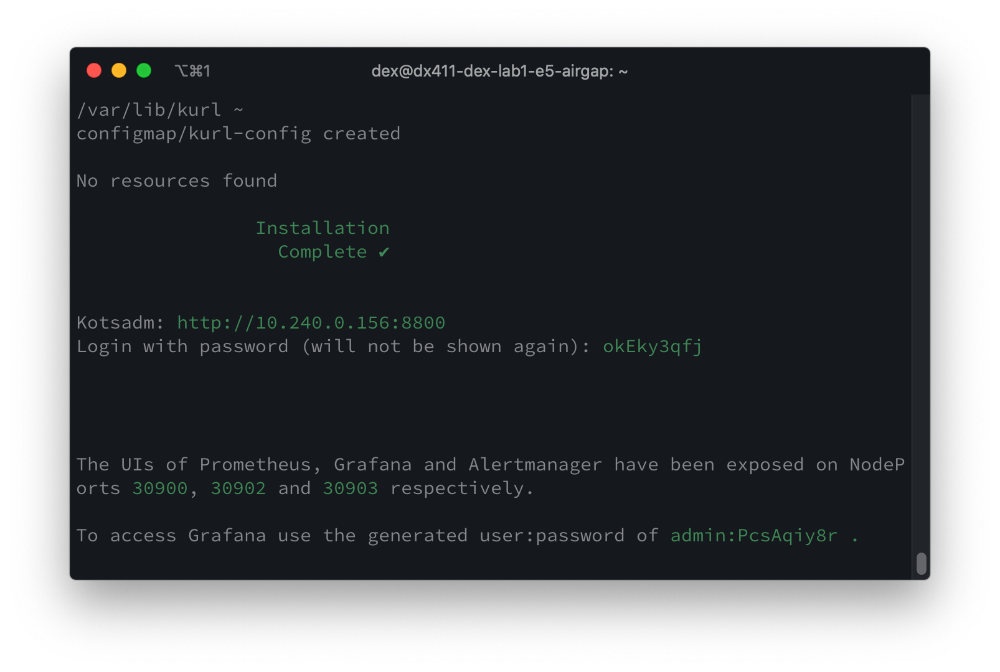

***
## Accessing the UI via SSH tunnel and configuring the instance

You must create a port forward from your workstation in order to access the UI locally. In this lab, we will use the `REPLICATED_APP` to construct the DNS name, but you can input it manually as well. This will run in the foreground, and you wont see any output.

```shell
export FIRST_NAME=... # your firstname (lowercase)
export JUMP_BOX_IP=... # your jumpbox IP
export REPLICATED_APP=... # your app slug
ssh -NL 8800:${REPLICATED_APP}-lab08-airgap-lite:8800 -L 8888:${REPLICATED_APP}-lab08-airgap-lite:8888 ${FIRST_NAME}@${JUMP_BOX_IP}
```

 At this point, Kubernetes and the Admin Console are running inside the air gapped server, but the application isn't deployed yet.

To complete the installation:
1. Visit http://localhost:8800 in your browser.

1. Click **Continue to Setup** in the browser to navigate to the secure Admin Console.

   

1. Click **Skip & continue** to Accept the insecure certificate in the admin console.
    > **Note**: For production installations we recommend uploading a trusted cert and key, but for this tutorial we will proceed with the self-signed cert.

   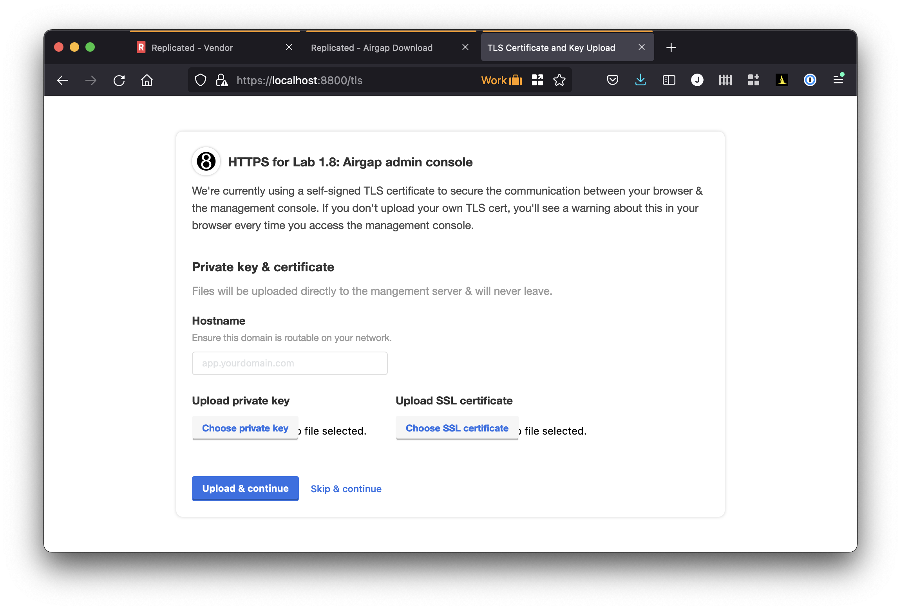

1. On the login screen, paste the password noted previously on the `Installation Complete` screen. The password is shown in the output from the installation script.

   

    Until this point, this server is just running Kubernetes and the `kotsadm` containers.
    The next step is to upload a license file so app manager can validate which application is authorized to be deployed. You must use the license file we downloaded earlier.

1. Click **Upload** and select your `.yaml` file to continue. You can also drag and drop the license file from a file browser. After you upload your license, you'll be greeted with an Airgap Upload screen.

   

1. Select **choose a bundle to upload** and use the application bundle that you
downloaded to your workstation using the customer portal. Click **Upload Air Gap bundle** to continue the upload process.

   

You'll see the bundle uploaded and images being pushed to kURL's internal registry. This will take a few minutes to complete.

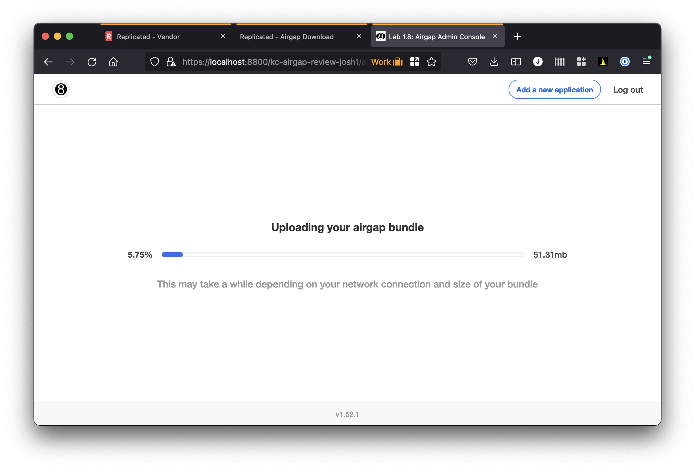

When the bundle is uploaded, `Preflight Checks` will run. These are designed to ensure the server has the minimum system and software requirements to run the application.
Depending on your YAML in the `preflight.yaml` file, you can see some of the example preflight checks fail.
If you have failing checks, you can click **Continue** and the UI will show a warning that will need to be dismissed before you can continue.


You will see that the application is unavailable.

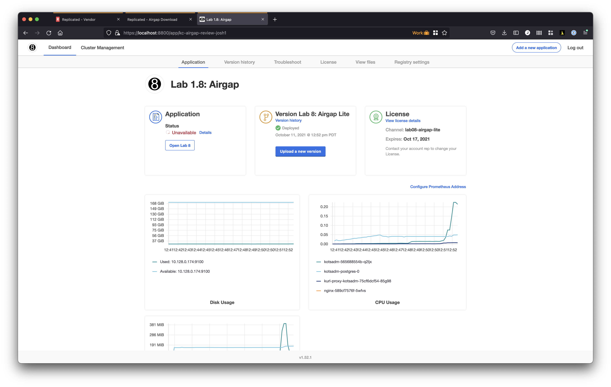

You will explore [support techniques for airgapped environments](#collecting-a-cli-support-bundle)
below, to observe that the deployment is simply not valid. Specifically, the
standard `nginx` entry point has been overridden:

```yaml
      containers:
        - name: nginx
          image: nginx
          command:
            - exit
            - "1"
```

You must deploy a new release in order to fix this error.

***
## Deploying a new version

As part of the lab setup, a new release was created in the Vendor Portal with the fix. To make the release available:
1. Navigate to **Sequence 2** under **All releases**.  
1. Click **Promote**.
1. Select the `lab08-airgap-lite` channel as the channel to promote the release to.

   

If you are interested, you can review the differences between the two releases in the Vendor Portal. It is also shown below:

```diff
diff --git a/labs/lab05-airgap/manifests/nginx-deployment.yaml b/labs/lab05-airgap/manifests/nginx-deployment.yaml
index fa29e8d..3a66405 100644
--- a/labs/lab05-airgap/manifests/nginx-deployment.yaml
+++ b/labs/lab05-airgap/manifests/nginx-deployment.yaml
@@ -16,9 +16,6 @@ spec:
       containers:
         - name: nginx
           image: nginx:latest
-          command:
-            - exit
-            - "1"
           volumeMounts:
             - mountPath: /usr/share/nginx/html
               name: html
```

When the promotion is done, you should be able to navigate back to the customer download portal we accessed from the customer page.
Scrolling to the bottom, you can click **Show older bundles** to see the history of the releases on the `lab08-airgap` channel.


The new release may take a minute or two to build. You can refresh the page until you see a release with a timestamp that matches when you promoted your release.

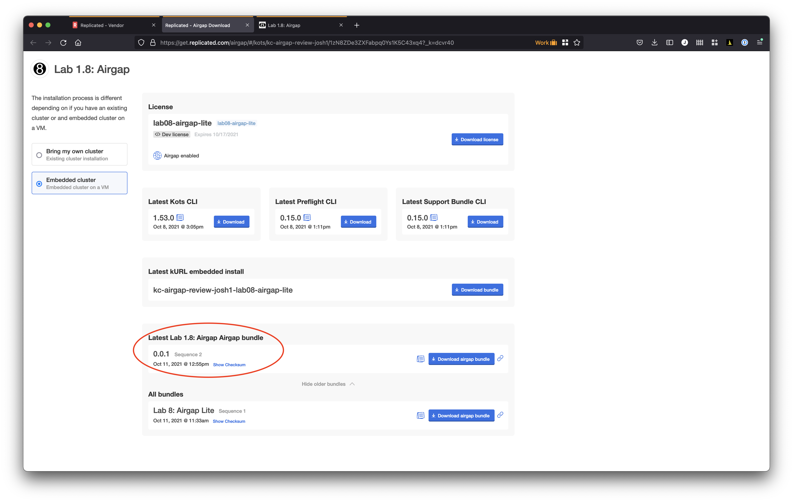

When you've downloaded the new version, you can now deploy it:
1. In the app manager Admin Console select **Version History**, click **Upload a new version**, and select your bundle.

   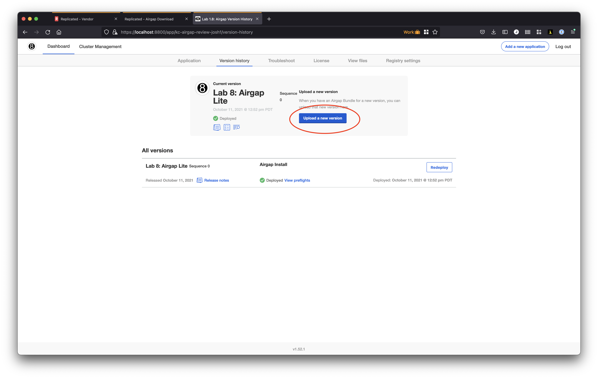

    You will see the bundle uploaded and you will have the option to deploy it once the preflight checks are complete.
1. Click **Deploy** to perform the upgrade.

1. Click **Application** to navigate back to the main landing page. The app should now show the **Ready** status on the main dashboard.

1. To access the application select **Open Lab 8**.
    > **Note**: The SSH tunnel for the application's port (8888) must be initialized for this to work successfully.

Congrats! You've installed and then upgraded an Air Gap instance!

***
## Collecting a CLI support bundle

Let's review how to collect support bundles. What would we do in the event that the app installation itself was failing?

You can try our `kots.io` support bundle from the Air Gap server.

```shell
kubectl support-bundle https://kots.io
```

As expected, this will fail because we can't fetch the spec from the internet.

```text
Error: failed to load collector spec: failed to get spec from URL: execute request: Get "https://kots.io": dial tcp 104.21.18.220:443: i/o timeout
```

In this case, you will want to pull in the spec from https://github.com/replicatedhq/kots/blob/master/support-bundle.yaml.

How you get this file onto the server is up to you. Expand the **Details** below for an option that uses `cat` with a heredoc.


<details>

```shell
cat <<EOF > support-bundle.yaml
apiVersion: troubleshoot.sh/v1beta2
kind: SupportBundle
metadata:
  name: collector-sample
spec:
  collectors:
    - clusterInfo: {}
    - clusterResources: {}
    - ceph: {}
    - exec:
        args:
          - "-U"
          - kotsadm
        collectorName: kotsadm-postgres-db
        command:
          - pg_dump
        containerName: kotsadm-postgres
        name: kots/admin_console
        selector:
          - app=kotsadm-postgres
        timeout: 10s
    - exec:
        args:
          - "http://localhost:3030/goroutines"
        collectorName: kotsadm-goroutines
        command:
          - curl
        containerName: kotsadm
        name: kots/admin_console
        selector:
          - app=kotsadm
        timeout: 10s
    - exec:
        args:
          - "http://localhost:3030/goroutines"
        collectorName: kotsadm-operator-goroutines
        command:
          - curl
        containerName: kotsadm-operator
        name: kots/admin_console
        selector:
          - app=kotsadm-operator
        timeout: 10s
    - logs:
        collectorName: kotsadm-postgres-db
        name: kots/admin_console
        selector:
          - app=kotsadm-postgres
    - logs:
        collectorName: kotsadm-api
        name: kots/admin_console
        selector:
          - app=kotsadm-api
    - logs:
        collectorName: kotsadm-operator
        name: kots/admin_console
        selector:
          - app=kotsadm-operator
    - logs:
        collectorName: kotsadm
        name: kots/admin_console
        selector:
          - app=kotsadm
    - logs:
        collectorName: kurl-proxy-kotsadm
        name: kots/admin_console
        selector:
          - app=kurl-proxy-kotsadm
    - logs:
        collectorName: kotsadm-dex
        name: kots/admin_console
        selector:
          - app=kotsadm-dex
    - logs:
        collectorName: kotsadm-fs-minio
        name: kots/admin_console
        selector:
          - app=kotsadm-fs-minio
    - logs:
        collectorName: kotsadm-s3-ops
        name: kots/admin_console
        selector:
          - app=kotsadm-s3-ops
    - secret:
        collectorName: kotsadm-replicated-registry
        includeValue: false
        key: .dockerconfigjson
        name: kotsadm-replicated-registry
    - logs:
        collectorName: rook-ceph-agent
        selector:
          - app=rook-ceph-agent
        namespace: rook-ceph
        name: kots/rook
    - logs:
        collectorName: rook-ceph-mgr
        selector:
          - app=rook-ceph-mgr
        namespace: rook-ceph
        name: kots/rook
    - logs:
        collectorName: rook-ceph-mon
        selector:
          - app=rook-ceph-mon
        namespace: rook-ceph
        name: kots/rook
    - logs:
        collectorName: rook-ceph-operator
        selector:
          - app=rook-ceph-operator
        namespace: rook-ceph
        name: kots/rook
    - logs:
        collectorName: rook-ceph-osd
        selector:
          - app=rook-ceph-osd
        namespace: rook-ceph
        name: kots/rook
    - logs:
        collectorName: rook-ceph-osd-prepare
        selector:
          - app=rook-ceph-osd-prepare
        namespace: rook-ceph
        name: kots/rook
    - logs:
        collectorName: rook-ceph-rgw
        selector:
          - app=rook-ceph-rgw
        namespace: rook-ceph
        name: kots/rook
    - logs:
        collectorName: rook-discover
        selector:
          - app=rook-discover
        namespace: rook-ceph
        name: kots/rook
    - exec:
        collectorName: weave-status
        command:
        - /home/weave/weave
        args:
        - --local
        - status
        containerName: weave
        exclude: ""
        name: kots/kurl/weave
        namespace: kube-system
        selector:
        - name=weave-net
        timeout: 10s
    - exec:
        collectorName: weave-report
        command:
        - /home/weave/weave
        args:
        - --local
        - report
        containerName: weave
        exclude: ""
        name: kots/kurl/weave
        namespace: kube-system
        selector:
        - name=weave-net
        timeout: 10s

  analyzers:
    - textAnalyze:
        checkName: Weave Status
        exclude: ""
        fileName: kots/kurl/weave/kube-system/weave-net-*/weave-status-stdout.txt
        outcomes:
        - fail:
            message: Weave is not ready
        - pass:
            message: Weave is ready
        regex: 'Status: ready'
    - textAnalyze:
        checkName: Weave Report
        exclude: ""
        fileName: kots/kurl/weave/kube-system/weave-net-*/weave-report-stdout.txt
        outcomes:
        - fail:
            message: Weave is not ready
        - pass:
            message: Weave is ready
        regex: '"Ready": true'
EOF
```
</details>

When this is present, you can use the following to collect a bundle as usual:

```shell
kubectl support-bundle ./support-bundle.yaml
```

You can review an in depth post with some other options at [How can i generate a support bundle if i cannot access the admin console?](https://help.replicated.com/community/t/kots-how-can-i-generate-a-support-bundle-if-i-cannot-access-the-admin-console/455).

Congrats! You've completed Exercise 8! [Back To Exercise List](https://github.com/replicatedhq/kots-field-labs/tree/main/labs)


***
## Extra exercises

If you finish the lab early you can:

1. Experiment with copying the CLI-generated bundle off the server and uploading it to https://vendor.replicated.com.
1. Experiment with expanding or building your own `support-bundle.yaml` and using it to collect other information about the host.
