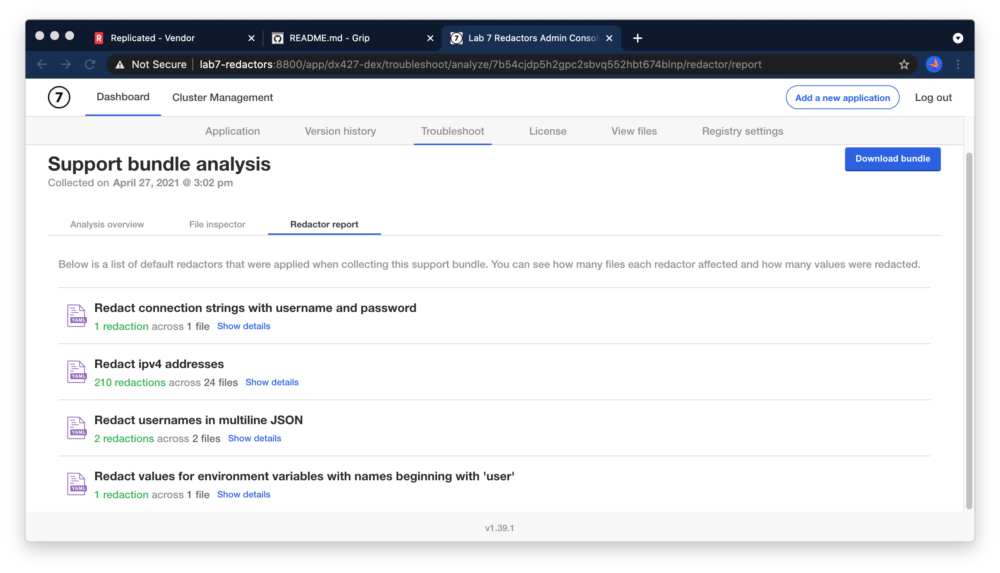
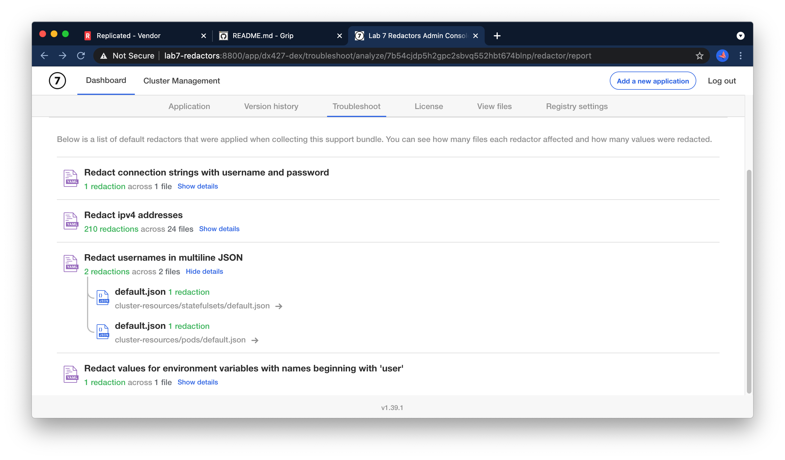
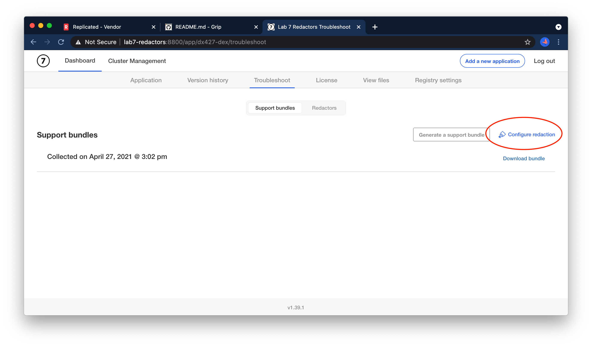
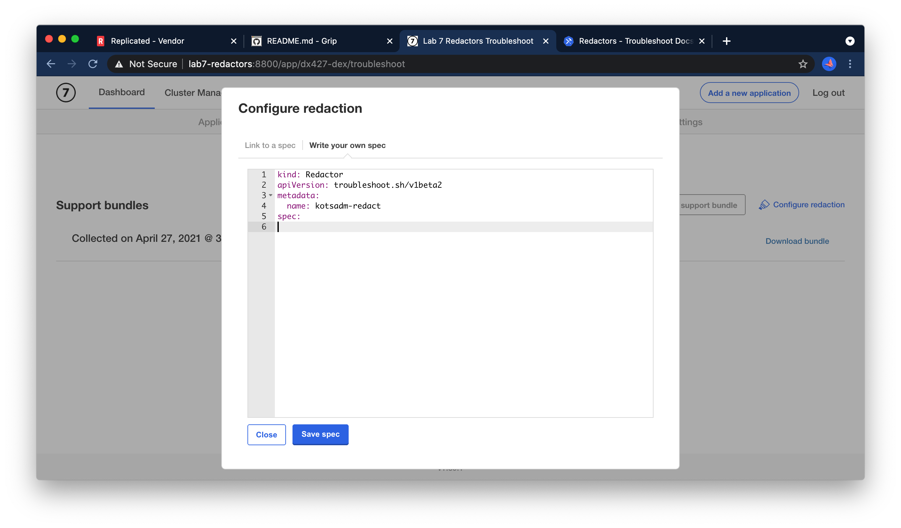
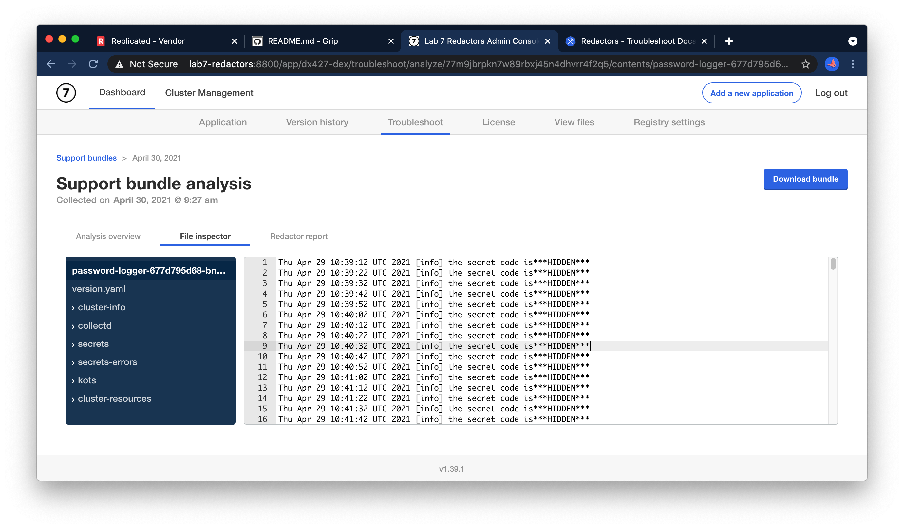

Lab 1.7: Redactors
=========================================

Redactors allow end users to promgramatically control which information is included in support bundles and which types of information are excluded.
They can be used to prevent sensitive data like usernames, IP addresses, and password from being accidentally leaked in support bundles.

In this lab, we'll explore how Redactors work and learn the workflows that end customers can use to review and customize redaction of support bundles.
We'll study an app that has a container that logs sensitive information, and how to ensure that information is excluded from support bundles.

You can open the KOTS admin console* for your node by navigating to https://lab3-support-cli:8800 in a browser. The password to your instance will be provided as part of the lab, or you can reset by SSHing into the node and running

```shell
kubectl kots reset-password -n default
```


### The application

Unlike some of the other labs, you'll notice that in this case, the app is up and running but that there's no "open".

That's to be expected.


### Redactors Overview

Let's straight away head to the Troubleshoot tab and collect a support bundle.
When it's done, head over to the "Redactor Report" tab.



You'll notice the following redaction rules are applied automatically

* Redact connection strings with username and password
* Redact ipv4 addresses
* Redact usernames in multiline JSON
* Redact values for environment variables with names beginning with 'user'

Clicking into one of these, you can review not only where redactions were perfomed, but actually click into files
and view where data was redacted:




### Sensitive data

On our same support bundle, navigate to the File Inspector tab and find the application logs.

You'll notice there's a secret being logged.


```shell
Tue Apr 27 19:54:00 UTC 2021 [info] the secret code is SW0RDF!SH
```

Next, we'll write a custom redactor to remove this from the support bundle.

### Adding a Custom redactor

To add a custom redactor, navigate back to the main Troubleshoot tab and select `Configure redaction`:



While a URL to a hosted redactor is possible, we'll use the `Write your own spec` option.

Reviewing the redactor documentation in the [troubleshoot.sh documentation](https://troubleshoot.sh/docs/redact/redactors/),
add a custom redactor to remove the secret code.



### Testing

Once you've edited redaction settings, you can collect another support bundle to review the effect.

When you've completed this successfully, you should see the secret removed from your bundle:

```text
Thu Apr 29 10:39:52 UTC 2021 [info] the secret code is ***HIDDEN***
```



### Answer

If you need a hint, you can click below for a redactor to hide the "secret code" from the logs.

<details>
    <summary>Reveal</summary>

```yaml
kind: Redactor
apiVersion: troubleshoot.sh/v1beta2
metadata:
  name: kotsadm-redact
spec:
  redactors:
    - name: hide-secret-code
      removals:
        regex:
          - redactor: (the secret code is )(?P<mask>.*)
```
</details>

